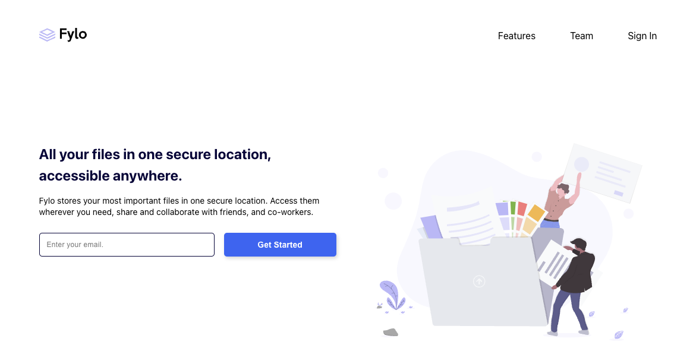

# Fylo Landing Page (Frontend Mentor)

This is a solution to the [Fylo Landing Page on Frontend Mentor](https://www.frontendmentor.io/challenges/fylo-landing-page-with-two-column-layout-5ca5ef041e82137ec91a50f5/hubm). Frontend Mentor challenges help you improve your coding skills by building realistic projects.

## Overview

### The challenge

Users should be able to:

- View the optimal layout for the site depending on their device's screen size
- See hover states for all interactive elements on the page

### Screenshot

### Links

- Live Site URL: [Netlify](https://jakegodsall-fylo-landing.netlify.app/)

## My process

### Built with

- Semantic HTML5 markup
- CSS Modules
- React.js
- create-react-app

## Author

- Website - [Jake Godsall](https://jakegodsall.com)
- Frontend Mentor - [@jakegodsall](https://www.frontendmentor.io/profile/jakegodsall)
- LinkedIn - [@godsalljake](https://www.linkedin.com/in/godsalljake/)

## Notes

This project was originally completed on 12th September 2022.

This repository is part of a series of repositories that have recently been cleaned and updated as part of an overhaul of my GitHub profile. The purpose of this overhaul was to ensure that each repository reflects my current development standards and practices, and to provide a cleaner, more professional appearance.

The project is updated as of 4th January 2024.

The recent enhancements to the project include:

- General overhaul of layout and styling of the landing page.
- Email form validation.
- Mobile menu bar with transitions.

## License

This project is open source and available under the [MIT License](https://github.com/jakegodsall/fm-fylo-landing-page/blob/main/LICENSE).
